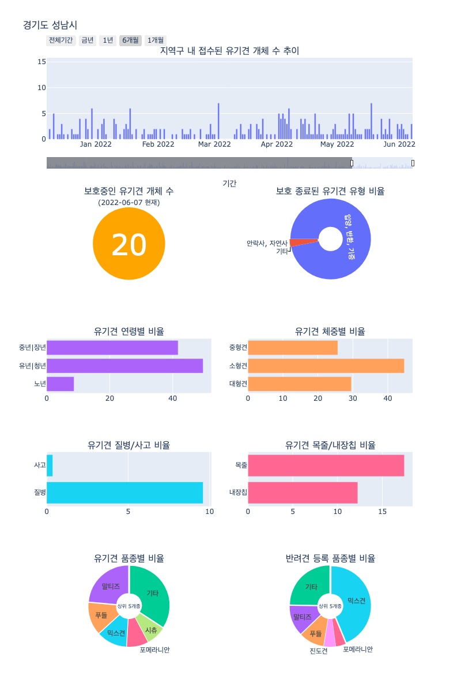

# 🐶유기동물9해조(Save Abandoned Do9)🐾

## 팀원
배진혁, 김예림, 이지홍, 윤세형, 정은지  
#

## 최종 시각화

  **전국 유기견 지도(2019년 6월 ~ 2022년 6월 현재)** [[Dashboard]](https://raw.githack.com/jihongleejihong/Save_abandoned_do9/main/%EC%A0%84%EA%B5%AD%20%EC%9C%A0%EA%B8%B0%EA%B2%AC%20%EC%A7%80%EB%8F%84(2019%EB%85%84%206%EC%9B%94%20~%202022%EB%85%84%206%EC%9B%94%20%ED%98%84%EC%9E%AC).html)

--- 

## 프로젝트 주제 선정 이유

**전국 유기동물 증가...입양률은 저조 / KBS 2022.05.21.** [(youtube)](https://www.youtube.com/watch?v=VDYwMWs7fgI)

**[바로간다] 반려동물 1천만에 늘어나는 유기동물‥결국은 '안락사'? (2021.11.01/뉴스데스크/MBC)** [(youtube)](https://www.youtube.com/watch?v=PyeFYGt4iZE&ab_channel=MBCNEWS)

<aside>
🐶 유기되는 동물의 숫자가 증가하고 있다는 소식을 뉴스에서 종종 접할 수 있습니다. 저희 팀에서는 유기동물 중에서도 많은 비율을 차지하는 강아지들을 대상으로 농림축산식품부의 유기동물 정보 조회 데이터를 분석하여 유기견과 지역, 품종, 나이, 체중, 상태 간의 상관관계를 알아보았습니다.

1. 유기된 강아지들과 입양된 강아지들의 **품종**은 어떤 **차이**가 있는지,
2. 유기된 강아지들의 **상태**와 **내장칩 유무**는 어떠한지,
3. 유기된 강아지들의 **나이**와 **체중**은 어떤 관계가 있는지
4. 연도, 분기별 **유기견 숫자**는 어떻게 **변화**하는지
5. 지역별로 유기동물이 보호소에 들어온 뒤 어떻게 **진행**되었는지에 대해 분석

**Folium**을 사용해 전국 **유기견들의 상태**를 한눈에 알아볼 수 있게 지도 위에 시각화  

#

## 스크린샷

